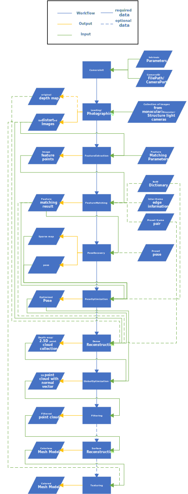

# Workflow and Pipeline
# Workflow and Pipeline

This project designed a series of sub-tasks in the pipeline to achieve 3D reconstruction tasks. We designed at most 11 sub-tasks from image acquisition to 3D mesh texturing (not all sub-tasks are required for different applications) in the pipeline. This pipeline is implemented based on Qt's signal-slot framework, each sub-tasks has a "Triggered" slot and a "finished" signal. Sub-tasks will run in each sub-tasks "Triggered" slot when this sub-task is triggered with input, and when the tasks are accomplished the "finished" signal will emit with output. This "finished" signal and output can be used as a call and input data for another sub-task. Thanks to the simple and flexible signal slot connection and disconnection method provided by Qt, the whole pipeline can be easily rearranged for different applications. Plus, the "MovetoThreads" method introduced by Qt Thread gives us a chance to allocate sub-tasks to different threads flexibly, thereby achieving parallel computing for the pipeline. The pipeline graph is as follows. Detailed information could also be obtained from each class's pages.

  

 overview of the 3D reconstruction pipeline 

