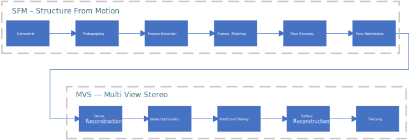

@mainpage
# EasyMVS: A Simple Multi-View Stereo lib
EasyMVS is a simple SFM(Structure From Motion) and MVS(Multi-View Stereo) project, which aims to perform 3D reconstruction tasks quickly and concisely with existing algorithms for Monocular, Stereo, RGBD cameras. This project currently supports OpenCV pinhole cameras but can be easily extended to other types of cameras, such as fish-eye cameras. 


<center> overview of the EasyMVS 3D reconstruction pipeline </center>

***
# THIS PROJECT IS NOT FINISHED YET, CANNOT ACHIEVE DESIRED TASKS AT CURRENT STAGE!
***

# Prerequisites
We have tested the library on Windows 11 with MSVC v143, but it should be easy to compile on other platforms such as Linux or MacOS. **We strongly recommend users use Vcpkg to manage the following libs.** [Vcpkg](https://vcpkg.io/)

## C++17 Compilers
We use c++17 standard to leverage the performance. Compilers that support C++17 standard can be found in the following link. [C++ compiler support](https://en.cppreference.com/w/cpp/compiler_support)

## Qt
This project put Qt as the center position for communication between each sub-tasks and thread management. Thanks to Qt's signal-slot features, a pipelined workflow can be easily implemented with low coupling. We use Qt for visualization as well. This project requires Qt5 or Qt6. Download and install instructions can be found at https://download.qt.io/

## OpenCV
We use OpenCV to manipulate images and features. Download and install instructions can be found at: http://opencv.org. Required at least 4.0. Tested with OpenCV 4.5.1.

## Eigen 3 and Sophus
We use Eigen and Sophus for better matrices operations. Download and install instructions for Eigen can be found at: http://eigen.tuxfamily.org. Required at least 3.1.0. Install instructions for Sophus can be found at: https://github.com/strasdat/Sophus

## DBoW2
This project uses the standard version of the DBoW2 library to perform place recognition. Download and install instructions can be found at: https://github.com/dorian3d/DBoW2

## PCL
This project uses PCL for point-cloud processing such as filtering and surface reconstruction. Download and install instructions can be found at: https://pointclouds.org/ **To support Point Cloud visualization with Qt, PCL has to be built from source code with Qt Options on. However, we strongly recommend users use Vcpkg to manage this and other libs. vcpkg can automatically build the PCL with correct configurations by simply typing the following command.**

```
vcpkg install pcl[qt,vtk,visualization]
```
## Ceres
This project uses ceres for optimization tasks, such as bundle adjustment. Download and instructions can be found at: http://www.ceres-solver.org/

## Miscellaneous
* [nlohmann_json](https://github.com/nlohmann/json
) >=3.10.5 for json file read and write. 
* [argparse](https://github.com/p-ranav/argparse) >= 2.2 for parsing from the command line.

# Usage
Some demos are listed in the app folder, including training your own BoW database from image sets, performing structure from motion from picture input and constructing the sparse map, or reading images from a video and storing data in the specially designed JSON format. Details of applications can be found in the ``./app`` folder.

# Data Structure
this project designed a series of data structures including ``Frames``, ``Mappoints``, ``Maps`` to leverage the 3D reconstruction process. The details of how each data structure works are shown in the [Data Structure](./doc/ClassDefinitionDraft.md) document. More information could also be obtained from each class's pages.

# Workflow and Pipeline
Similar to many existing SFM projects, this project uses pipeline-based workflow as well. We designed at most 11 sub-tasks from image acquisition to 3D mesh texturing (not all sub-tasks are required for different applications) in the pipeline. This pipeline is implemented based on Qt's signal-slot framework, each sub-tasks has a "Triggered" slot and a "finished" signal. Sub-tasks will run in each sub-tasks "Triggered" slot when this sub-task is triggered with input, and when the tasks are accomplished the "finished" signal will emit with output. This "finished" signal and output can be used as a call and input data for another sub-task. Thanks to the simple and flexible signal slot connection and disconnection method provided by Qt, the whole pipeline can be easily rearranged for different applications. Plus, the "MovetoThreads" method introduced by Qt Thread gives us a chance to allocate sub-tasks to different threads flexibly, thereby achieving parallel computing for the pipeline. More information on workflow is shown in the [Pipeline and Workflow](./doc/Pipeline.md) document. Detailed information could also be obtained from each class's pages.


# Credits
**Author**
[Zishun Zhou](https://blog.zzshub.cn/)


